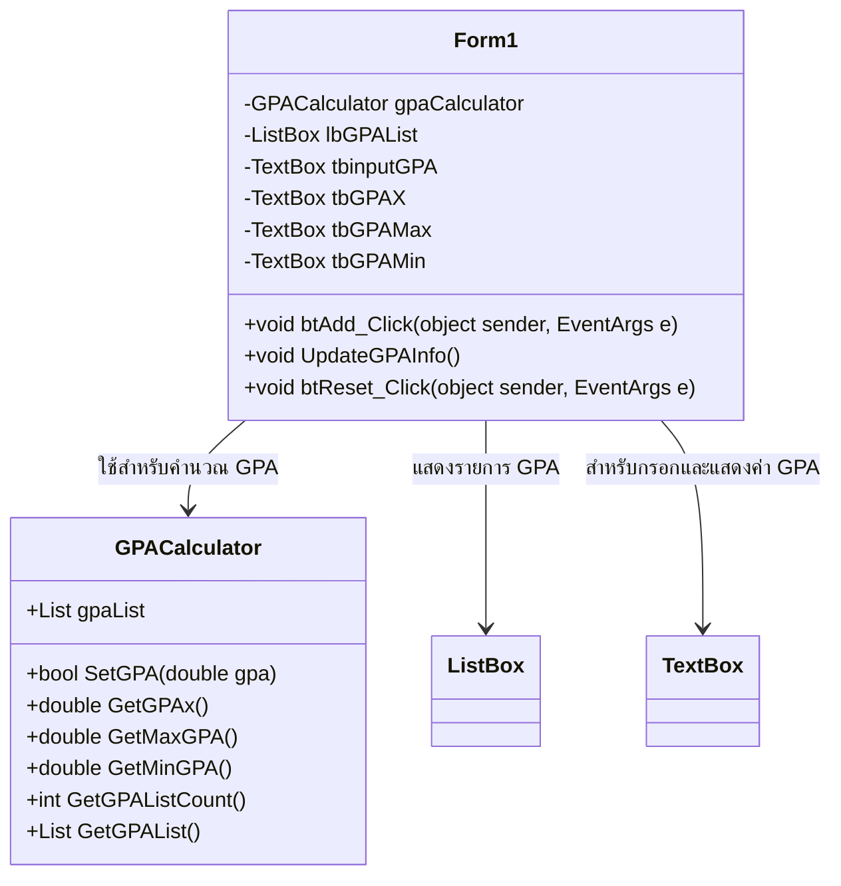

# GPAX

```mermaid
classDiagram
    class GPACalculator {
        +List<double> gpaList
        +bool SetGPA(double gpa)
        +double GetGPAx()
        +double GetMaxGPA()
        +double GetMinGPA()
        +int GetGPAListCount()
        +List<double> GetGPAList()
    }
    class Form1 {
        -GPACalculator gpaCalculator
        -ListBox lbGPAList
        -TextBox tbinputGPA
        -TextBox tbGPAX
        -TextBox tbGPAMax
        -TextBox tbGPAMin
        +void btAdd_Click(object sender, EventArgs e)
        +void UpdateGPAInfo()
        +void btReset_Click(object sender, EventArgs e)
    }
    
    Form1 --> GPACalculator : ใช้สำหรับคำนวณ GPA
    Form1 --> ListBox : แสดงรายการ GPA
    Form1 --> TextBox : สำหรับกรอกและแสดงค่า GPA
```
